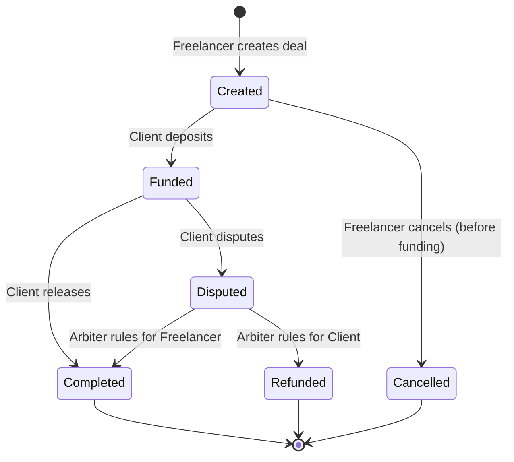

# ArbiSecure - Page Definitions

This document outlines all frontend pages for the ArbiSecure platform.

---

## User Flow Summary (from PRD)

1.  **Initiation:** Freelancer creates a deal link.
2.  **Funding:** Client deposits funds.
3.  **Release:** Client releases funds.
4.  **Dispute:** Client initiates a dispute.

---

## Core Pages (MVP)

### 1. Landing Page (`/`)
**Purpose:** Marketing and onboarding.
**Audience:** All visitors.
**Key Sections:**
-   Hero with value proposition.
-   How It Works (3-step process).
-   Features (Low Fees, Security, Speed).
-   Live Escrows (Social proof).
-   Fees Comparison.
-   Footer with links.
**CTA:** "Create Escrow", "Learn More".

---

### 2. Create Deal Page (`/create`)
**Purpose:** Freelancer defines terms and generates a unique shareable link.
**Audience:** Freelancers.
**Form Fields:**
-   Client Wallet Address (required).
-   Amount in USDC (required).
-   Deal Title/Description (optional).
-   Deadline (optional).
-   Arbiter Address (optional, for disputes).
**Output:** Unique Deal URL (e.g., `arbisecure.xyz/deal/0x...`).
**Contract Interaction:** `createDeal(...)`.

---

### 3. Deal Detail Page (`/deal/[id]`)
**Purpose:** View deal status and take actions.
**Audience:** Client, Freelancer, Arbiter.
**Sections:**
-   Deal Summary (Amount, Parties, Status, Deadline).
-   Activity Log (Created, Funded, Released, Disputed).
-   Action Buttons (context-aware by role and state).
**Client Actions:** `Deposit`, `Release`, `Dispute`.
**Freelancer Actions:** View, (Future: Mark Delivered).
**Arbiter Actions:** `Resolve Dispute` (Release to Freelancer or Refund to Client).
**Contract Interaction:** `deposit()`, `release()`, `dispute()`, `resolveDispute()`.

---

## Dashboard Pages

### 4. Dashboard Overview (`/dashboard`)
**Purpose:** Aggregated view of user's escrow activity.
**Audience:** Logged-in users (Client or Freelancer).
**Sections:**
-   Quick Stats: Total Deals, Active Deals, Total Value Secured, Total Earned/Paid.
-   Recent Activity feed.
-   Quick Create button.

---

### 5. My Deals Page (`/dashboard/deals`)
**Purpose:** List all deals where user is a participant.
**Audience:** Logged-in users.
**Features:**
-   Table/List of deals with: Title, Counterparty, Amount, Status, Date.
-   Filter by Role: As Freelancer, As Client, As Arbiter.
-   Filter by Status: Created, Funded, Completed, Disputed, Refunded.
-   Search by Deal ID or Counterparty Address.
-   Pagination.

---

### 6. Deal History Page (`/dashboard/history`)
**Purpose:** View completed or cancelled deals.
**Audience:** Logged-in users.
**Features:**
-   List of past deals (Completed, Refunded, Cancelled).
-   Total stats: Volume, Count.
-   Export to CSV (future).

---

### 7. Active Deals Page (`/dashboard/active`)
**Purpose:** View only in-progress deals (Created, Funded, Disputed).
**Audience:** Logged-in users.
**Features:**
-   Live status updates.
-   Quick action buttons.

---

## Profile & Settings Pages

### 8. Profile Page (`/profile` or `/dashboard/profile`)
**Purpose:** View and manage wallet profile.
**Audience:** Logged-in users.
**Features:**
-   Connected Wallet Address display.
-   ENS Name display (if available).
-   User stats: Total Deals, Success Rate, Volume.
-   (Future) Reputation score.

---

### 9. Settings Page (`/dashboard/settings`)
**Purpose:** User preferences.
**Audience:** Logged-in users.
**Features:**
-   Notification preferences (email, push - future).
-   Default Arbiter address.
-   (Future) Enable Paymaster/Gas Sponsorship.

---

## Static & Legal Pages

### 10. How It Works Page (`/how-it-works`)
**Purpose:** Detailed explanation of the platform.
**Audience:** New visitors.
**Content:**
-   Step-by-step guide with visuals.
-   FAQ section.

---

### 11. About Page (`/about`)
**Purpose:** Team and project information.
**Audience:** All visitors.
**Content:**
-   Mission statement.
-   Team bios.
-   Arbitrum & Stylus technology explanation.

---

### 12. Fees Page (`/fees`)
**Purpose:** Transparent fee breakdown.
**Audience:** All visitors.
**Content:**
-   Protocol fee percentage.
-   Arbitrum gas cost estimates.
-   Comparison with legacy platforms.

---

### 13. Terms of Service (`/terms`)
**Purpose:** Legal terms.
**Audience:** All users.

---

### 14. Privacy Policy (`/privacy`)
**Purpose:** Data handling policy.
**Audience:** All users.

---

## Error & Utility Pages

### 15. 404 Not Found (`/404`)
**Purpose:** Handle missing routes.
**Content:** Friendly error message, link to home.

---

### 16. Connect Wallet Page (`/connect` or modal)
**Purpose:** Prompt user to connect wallet.
**Trigger:** Accessing authenticated pages without connection.
**Features:** RainbowKit/Wagmi modal integration.

---

## State Diagram

